<!-- Animated Header -->

  

<!-- Typing Animation -->

  

<!-- Social Links -->

  
  
  
  

 

<!-- About Me Section with Gradient Border -->

  

##  About Me

- 🎓 **Computer Science Student** at October 6 University (GPA: 3.8)
- 🚀 **Data Science & AI Trainee** at Digital Egypt Pioneers Initiative (DEPI)
- 💡 Passionate about **Machine Learning**, **NLP**, and **Computer Vision**
- 🏆 **Competitive Programming Level 3** - Coach Academy Certified
- 🔭 Currently working on **Advanced NLP Models** and **MLOps**
- 🌱 Learning **Transformers**, **GANs**, and **Cloud AI Services**

 

<!-- Featured Projects -->
## 🚀 Featured Projects

  
| Project | Description | Technologies | Achievement |
|---------|-------------|--------------|-------------|
| **🌐 Machine Translation Model** | Neural translation system for English-Arabic with 17,319 clean sentence pairs |    | **99.5% Accuracy** |
| **🏃 Human Activity Recognition** | HAR system using WISDM dataset with CNN-Bidirectional LSTM |   | **99.3% Accuracy** |
| **👁️ ISEE Virtual Assistant** | Assistive system for visually impaired with real-time object detection |    | **98% NLP Accuracy** |

<!-- GitHub Stats -->
## 📊 GitHub Analytics

  
  

  

<!-- Skills Section with Animated Icons -->
## 🛠️ Technical Arsenal

### 🤖 Machine Learning & AI

### 💬 NLP & Deep Learning

### 📊 Data Science

### ☁️ Cloud & MLOps

### 💻 Programming

<!-- Activity Graph -->
## 📈 Contribution Graph

  

<!-- Snake Animation -->

  <picture>
    <source media="(prefers-color-scheme: dark)" srcset="https://raw.githubusercontent.com/Mahmoud-Zaafan/Mahmoud-Zaafan/output/github-contribution-grid-snake-dark.svg">
    <source media="(prefers-color-scheme: light)" srcset="https://raw.githubusercontent.com/Mahmoud-Zaafan/Mahmoud-Zaafan/output/github-contribution-grid-snake.svg">
    
  </picture>

<!-- Achievements -->
## 🏆 Achievements & Certifications

  
- 🎯 **99.5% Validation Accuracy** - Machine Translation Model (English-Arabic)
- 🥇 **99.3% Test Accuracy** - Human Activity Recognition System  
- 🏅 **Level 3 Competitive Programming** - Coach Academy Certified
- 📜 **Data Science & AI Graduate** - Digital Egypt Pioneers Initiative (DEPI)
- 🌟 **98% Accuracy** - NLP Model for ISEE Virtual Assistant

<!-- Professional Experience Timeline -->
## 💼 Professional Journey

```mermaid
graph LR
    A[Oct 2021] -->|Started CS Degree| B[October 6 University]
    B --> C[Apr 2024]
    C -->|DEPI Training| D[Data Science & AI]
    D --> E[May 2024]
    E -->|Coach Academy| F[Competitive Programming L3]
    F --> G[Oct 2024]
    G -->|Completed Projects| H[ML/NLP/CV Solutions]
    H --> I[Present]
    I -->|Ongoing| J[Advanced AI Research]
```

<!-- Footer -->

  

  
  
  ### 💬 Let's Connect and Build Something Amazing Together!
  
  <i>"Transforming data into intelligence, one algorithm at a time."</i>

<!-- Wave Animation Footer -->

  

